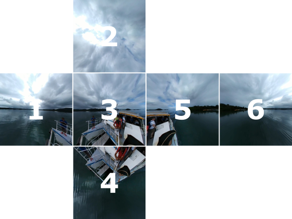

# Style Transfer

## Prerequisites
- Python 3.7
- [PyTorch 1.12.0](http://pytorch.org/)
- [NumPy](http://www.numpy.org/)
- [PIL](http://pillow.readthedocs.io/en/3.1.x/installation.html)

## Datasets
- Download [Coco Dataset](https://cocodataset.org/#download) - 2014 Train images [83K/13GB]
- Download [Panorama Dataset](https://www.dropbox.com/s/skxqj94rno9ihjq/360-Dataset.zip?dl=0)

Convert equirectangular images from 360 dataset to cubemaps, which will be saved into a folder ```360_dataset/cubemaps```, with the following command:

```bash
$ python generate_dataset.py
```

## Installation
Pull the repository:
```bash
git clone https://github.com/JussiKalliola/PanoramaStyleTransfer.git
git submodule update --init --recursive
```

## Cubemap order
Following cubemap order (and ids) are used for perspective transformation and masking. E.g., Image with ID 1 has neighboring images of 2, 3, 4, and 6. Input to the network is: (Image1, Image1 ID, Neighboring Image, Neighboring Image ID), e.g., (1.jpg, '1', 3.jpg, '3') 



## Usage
### Train

You can train a model for a given style image with the following command:

```bash
# Train image transformer
$ python style.py train --style-image "path_to_style_image" --dataset "path_to_coco"
# Train panorama transformer
$ python style_panorama.py train --style-image "path_to_style_image" --dataset "path_to_cubemaps"
```

Here are some options that you can use:
* `--gpu`: id of the GPU you want to use (if not specified, will train on CPU)
* `--visualize`: visualize the style transfer of a predefined image every 1000 iterations during the training process in a folder called "visualize"
* `--epochs`: Number of training epochs. Default is 1.
* `--model-path`: Continue training the previous model. Default is to init a new model.

So to train on a GPU with mosaic.jpg as my style image, MS-COCO downloaded into a folder named coco / 360 dataset downloaded into a folder 360_dataset, and wanting to visualize a sample image throughout training, I would use the following command: 

```bash
$ python style.py train --style-image style_imgs/mosaic.jpg --dataset coco --gpu 1 --visualize 1
$ python style_panorama.py train --style-image style_imgs/mosaic.jpg --dataset 360_dataset/cubemaps --epochs 5 --model-path 'models/panorama/mosaic.model' --gpu 1 --visualize 1
```

### Evaluation

You can stylize an image with a pretraind model with the following command. Pretrained models for mosaic.jpg and udine.jpg are provided.

```bash
$ python style.py transfer --model-path "path_to_pretrained_model_image" --source "path_to_source_image" --output "name_of_target_image"
```

You can also specify if you would like to run on a GPU:
* `--gpu`: id of the GPU you want to use (if not specified, will train on CPU)

For example, to transfer the style of mosaic.jpg onto maine.jpg on a GPU, I would use:

```bash
$ python style.py transfer --model-path model/1657989431_mosaic.model --source content_imgs/maine.jpg --output maine_mosaic.jpg --gpu 1
```


## Acknowledgements
* This repo is based on code found in [this PyTorch example repo](https://github.com/dxyang/StyleTransfer)
